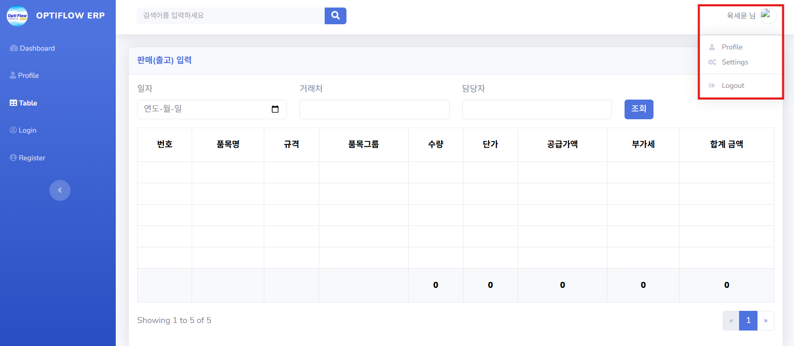
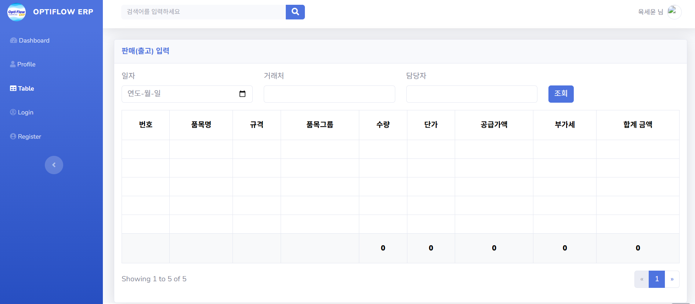
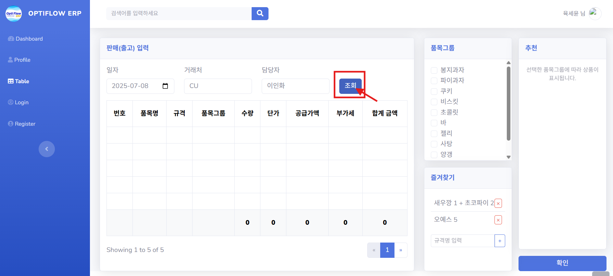
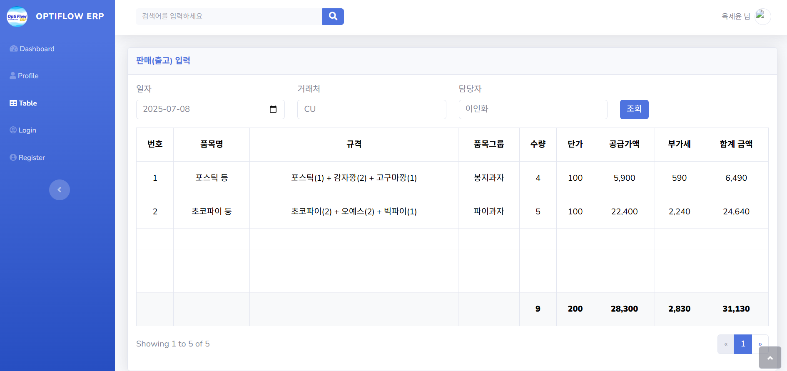
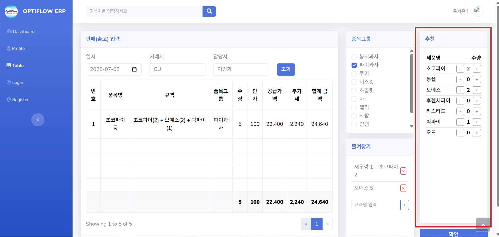
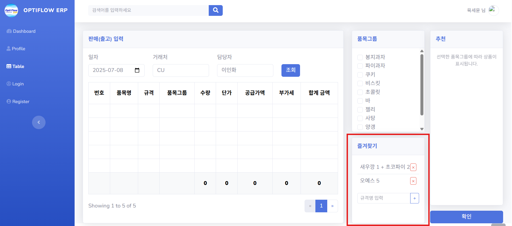

# 📉 실무자들의 효율적인 전산 사용 및 업무를 돕는 ERP 프로그램
## ⭐팀명: 일등할 공대, 다들 환호해조(18기 1조)⭐

## ✨팀원✨
<table style="width:100%;">
  <thead>
    <tr align="center">
      <th>팀장</th>
      <th>팀원</th>
      <th>팀원</th>
      <th>팀원</th>
    </tr>
  </thead>
  <tbody>
    <tr align="center">
      <td>
        
      </td>
      <td>
        
      </td>
      <td>
        
      </td>
      <td>
        
      </td>
    </tr>
    <tr align="center">
      <td>육세윤</td>
      <td>이인화</td>
      <td>서현원</td>
      <td>최정필</td>
    </tr>

  </tbody>
</table>

## 📚 목차
1. [📂 프로젝트 소개](#intro)
   1) [🎯 프로젝트 주제](#topic)
   2) [📱 프로젝트 배경](#background)
    
2. [📝 요구사항 명세서](#requirements)
   
4. [🔗 ERD](#erd-link)
   
6. [📄 테이블 명세서](#table_specifications)
   
8. [👨‍💻 프로젝트 후기](#retrospective)

 

## 1. 프로젝트 소개
###  1) 프로젝트 주제
- 유통업 영업 사원의 효율적인 판매 관리 시스템
###  2) 프로젝트 배경
-  현 프로젝트에서 특정하는 회사는 복잡한 프로세스를 채용하고 있습니다. 이로 인해 잦은 휴먼 에러가 발생합니다. 또한, 외감 대비 시 백데이터 준비가 부실하므로 부적정 의견을 판정 받을 가능성이 높아집니다.
  
-  이를 해결하기 위해, 판매 입력 시 실무자의 수율을 향상시키는 ERP 시스템을 개발했습니다. 본 시스템을 통해 해당 회사의 임직원는 판매 및 구매 입력에서, 해당 회사의 거래처는 주문 입력 시 복잡하고 입력하기 번거로운 데이터를 입력할 때 시간 및 비용을 절감할 수 있습니다.

 

## 2. 요구사항 명세서

요구사항 명세서 링크

[https://docs.google.com/spreadsheets/d/1rTjaT62c36xYGsWzVaBISN6cNFUnTbNTU2lRPsEm0gU/edit?gid=67669380#gid=67669380]

- ### 시스템
 

1. 회원관리

1) 사용자 등록

     : 아이디, 비밀번호, 이름, 연락, 이메일, 주민등록번호 등 기입

   
2) 가입 승인 및 권한 설정

    : 관리자는 가입 요청 목록 확인 및 승인 또는 반려 가능

3) 가입 결과 알림

    : 성공 시 로그인 페이지, 실패 시 오류 메세지 출력

4) 기본 로그인 기능

    : 등록된 사용자만 아이디/ 비밀번호로 로그인

5) 접근권한 제어

    : 사용자 권한에 따라, 접근 메뉴 달라짐

6) 로그인 상태 유지/ 만료

    : 일정 시간 무활동 시, 자동 로그아웃 및 수동 로그아웃 가능

   

2. 품목관리

  
1) 품목 등록

    : 품목명, 품목코드, 단위 등 신규 품목 등록

- 기본화면
  
   
2) 품목 사용 중지

    : 비활성화 처리, 추천 및 검색에 노출 안됨.
   
3) 품목 삭제

    : 이전 수불 기록이 없는 경우에만 가능

4) ⭐품목 검색⭐

    : 품목명/ 코드/ 검색창 내용 검색
- 품목검색

    
- 검색창내용

5) 품목 수정

    : 관리자는 품목 단위, 수량, 명칭 수정 및 검색창내용 추가 가능

6) 품목 상세보기

    : 규격, 단위, 재고 수량, 검색창내용 등을 확인 가능

⭐3. 납품 이력 관리⭐

1) 구매 전표 입력

      : 거래처, 구매 일자, 납기 일자 등 기본 정보 입력
   
- 거래 날짜 설정
  

2) 품목 및 수량 입력
  
    : 품목 추가, 수량, 구매 단가 등 입력

3) 구매 전표 저장 및 수정

    : 작성 중인 구매 전표 저장 또는 임시저장

4) 구매 전표 조회 및 검색

    : 기간별, 공급처별, 품목별, 과거 구매 이력 주문서 조회 및 검색

5) 구매 전표 상태 관리

    : '작성중', '주문완료' 등 상태 표시 및 상태 변경 시 이력 남음

6) 판매 주문서 입력

    : 판매 주문서의 기본 정보(판매처, 주문일자, 납기 일자 등) 입력

7) 품목 및 수량 입력

    : 품목 검색 및 추가, 수량, 판매 단가 입력

8) 판매 주문서 저장 및 수정

    : 판매 전표 저장 및 임시저장

  - 판매 주문서
  

9) 판매 주문서 조회 및 검색

    : 과거 판매 이력 주문서 조회 및 검색

10) 판매 주문서 상태 관리
    
       : 판매 상태 변경 및 추적

⭐4. 입력 추천 관리⭐

#### ⭐4. 입력 추천 관리⭐
1) 거래처 추천 입력

    : 거래처별 과거 구매/ 판매 이력을 기반으로 입력 시 추천 품목 TOP10을 자동으로 노출

2) 영업사원 품목 추천

    : 해당 영업사원의 판매 빈도수에 비례하여, 품목 리스트를 추천

- Top 10 품목 추천
  

3) 추천 품목 편집

    : 자동 추천된 품목 리스트를 사용자가 직접 편집 가능

4) 수동 입력 병행

   : 사용자 임의로 직접 조회 및 입력

⭐5. 통계 및 조회 시스템⭐

#### ⭐5. 통계 및 조회 시스템⭐
1) 구매관리

    : 품목별 입고 통계 조회

2) 재고관리

    : 품목별 현재 재고 조회

3) 출하 및 판매관리

    : 거래처별 출고, 매출 통계

4) 관리지원

    : 사용자 조회 이력 기록

⭐6. 메뉴 즐겨찾기 설정⭐

  
1) 즐겨찾기 등록

    : 사용자가 자주 사용하는 품목을 등록하는 기능.
   
- 즐겨찾기 등록
  

2) 즐겨찾기 조회

    : 즐겨찾기 탭 목록 표시

3) 즐겨찾기 삭제

    : 각 항목 옆에 '삭제' 버튼

4) 즐겨찾기 순서 변경

    : 드래그 앤 드롭으로 순서 변경

 

## 3. ERD

 ERD 이미지 

 

## 4. 테이블 명세서

테이블 명세서 링크

(https://docs.google.com/spreadsheets/d/1rTjaT62c36xYGsWzVaBISN6cNFUnTbNTU2lRPsEm0gU/edit?usp=sharing)

 

## 5. 프로젝트 후기
| 이름 | 후기                 |
|:---:|:-------------------|
| 육세윤 | (여기에 후기를 작성해 주세요.) |
| 이인화 |  지금까지 한 팀플 중에서, 최고었습니다. 우리 팀원들 최고에요!          |
| 서현원 |                    |
| 최정필 |                    |
