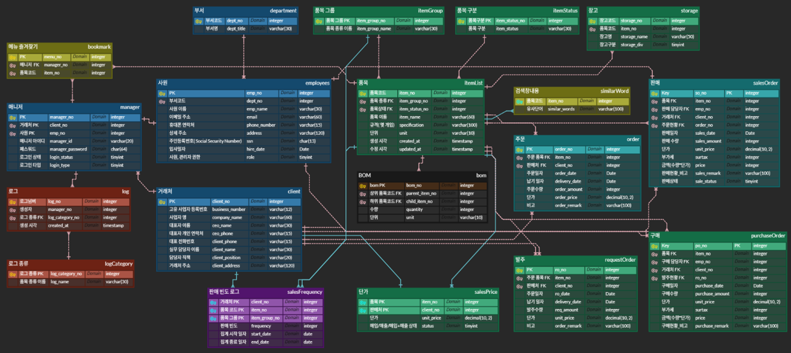

<p align="center">
  
</p>


# 📉 OptiFlow - 실무자 중심의 스마트 ERP 프로그램
## ⭐팀명: 일등할 공대, 다들 환호해조(18기 1조)⭐

## ✨팀원✨
<table style="width:100%;">
  <thead>
    <tr align="center">
      <th>팀장</th>
      <th>팀원</th>
      <th>팀원</th>
      <th>팀원</th>
    </tr>
  </thead>
  <tbody>
    <tr align="center">
      <td>
        <a href="https://github.com/KorSwib" target="_blank">
          
        </a>
      </td>
      <td>
        <a href="https://github.com/Inhwa1003" target="_blank">
          
        </a>
      </td>
      <td>
        <a href="https://github.com/viroovr" target="_blank">
          
        </a>
      </td>
      <td>
        <a href="https://github.com/wjdvlf5456" target="_blank">
          
        </a>
      </td>
    </tr>
    <tr align="center">
      <td>육세윤</td>
      <td>이인화</td>
      <td>서현원</td>
      <td>최정필</td>
    </tr>

  </tbody>
</table>


## 📚 목차
1. [📂 프로젝트 소개](#intro)
   1) [🎯 프로젝트 주제](#topic)
   2) [📱 프로젝트 배경](#background)
    
2. [📝 요구사항 명세서](#requirements)
   
4. [🔗 ERD](#erd-link)
   
6. [📄 테이블 명세서](#table-specifications)

8. [📄 DB DDL](#db-ddl)

9. [📄 DB DML](#db-dml)
   
8. [👨‍💻 프로젝트 후기](#retrospective)


<br>


## <a id="intro"></a>1. 프로젝트 소개
### <a id="topic"></a> 1) 프로젝트 주제
- 유통업 영업 사원의 효율적인 판매 관리 시스템
### <a id="background"></a> 2) 프로젝트 배경
-  현 프로젝트에서 특정하는 회사는 복잡한 프로세스를 채용하고 있습니다. 이로 인해 잦은 휴먼 에러가 발생합니다. 또한, 외감 대비 시 백데이터 준비가 부실하므로 부적정 의견을 판정 받을 가능성이 높아집니다.
  
-  이를 해결하기 위해, 판매 입력 시 실무자의 수율을 향상시키는 ERP 시스템을 개발했습니다. 본 시스템을 통해 해당 회사의 임직원는 판매 및 구매 입력에서, 해당 회사의 거래처는 주문 입력 시 복잡하고 입력하기 번거로운 데이터를 입력할 때 시간 및 비용을 절감할 수 있습니다.


<br>


## <a id="requirements"></a>2. 요구사항 명세서

<details>
<summary>요구사항 명세서 링크</summary>
<div markdown="1">
[https://docs.google.com/spreadsheets/d/1rTjaT62c36xYGsWzVaBISN6cNFUnTbNTU2lRPsEm0gU/edit?gid=67669380#gid=67669380]
</div>
</details>

- ### 시스템
 <details>
<summary>1. 회원관리</summary>
<div markdown="1">

1) 사용자 등록

     : 아이디, 비밀번호, 이름, 연락, 이메일, 주민등록번호 등 기입

   
2) 가입 승인 및 권한 설정

    : 관리자는 가입 요청 목록 확인 및 승인 또는 반려 가능

3) 가입 결과 알림

    : 성공 시 로그인 페이지, 실패 시 오류 메세지 출력

4) 기본 로그인 기능

    : 등록된 사용자만 아이디/ 비밀번호로 로그인

5) 접근권한 제어

    : 사용자 권한에 따라, 접근 메뉴 달라짐

6) 로그인 상태 유지/ 만료

    : 일정 시간 무활동 시, 자동 로그아웃 및 수동 로그아웃 가능

   
</div>
</details>

<details>
<summary>2. 품목관리</summary>
<div markdown="1">
  
1) 품목 등록

    : 품목명, 품목코드, 단위 등 신규 품목 등록

- 기본화면
  
   
2) 품목 사용 중지

    : 비활성화 처리, 추천 및 검색에 노출 안됨.
   
3) 품목 삭제

    : 이전 수불 기록이 없는 경우에만 가능

4) ⭐품목 검색⭐

    : 품목명/ 코드/ 검색창 내용 검색
- 품목검색

    
- 검색창내용


5) 품목 수정

    : 관리자는 품목 단위, 수량, 명칭 수정 및 검색창내용 추가 가능

6) 품목 상세보기

    : 규격, 단위, 재고 수량, 검색창내용 등을 확인 가능
</div>
</details>


<details>
<summary>⭐3. 납품 이력 관리⭐</summary>
<div markdown="1">

1) 구매 전표 입력

      : 거래처, 구매 일자, 납기 일자 등 기본 정보 입력
   
- 거래 날짜 설정
  

2) 품목 및 수량 입력
  
    : 품목 추가, 수량, 구매 단가 등 입력

3) 구매 전표 저장 및 수정

    : 작성 중인 구매 전표 저장 또는 임시저장

4) 구매 전표 조회 및 검색

    : 기간별, 공급처별, 품목별, 과거 구매 이력 주문서 조회 및 검색

5) 구매 전표 상태 관리

    : '작성중', '주문완료' 등 상태 표시 및 상태 변경 시 이력 남음

6) 판매/ 주문서 입력

    : 판매/ 주문서의 기본 정보(판매처, 주문일자, 납기 일자 등) 입력

7) 품목 및 수량 입력

    : 품목 검색 및 추가, 수량, 판매 단가 입력

8) 판매/ 주문서 저장 및 수정

    : 판매/ 주문서 전표 저장 및 임시저장

  - 판매/ 주문서
  

9) 판매/ 주문서 조회 및 검색

    : 과거 판매 이력 주문서 조회 및 검색

10) 판매/ 주문서 상태 관리
    
       : 판매 상태 변경 및 추적

</div>
</details>


<details>
<summary>⭐4. 입력 추천 관리⭐</summary>
<div markdown="1">

1) 거래처 추천 입력

    : 거래처별 과거 구매/ 판매 이력을 기반으로 입력 시 추천 품목 TOP10을 자동으로 노출

2) 영업사원 품목 추천

    : 각 영업 사원의 판매 빈도수에 비례하여, 최적화된 품목 리스트를 제공


- Top 10 품목 추천
  

3) 추천 품목 편집

    : 자동 추천된 품목 리스트를 사용자가 직접 편집 가능

4) 수동 입력 병행

   : 사용자 임의로 직접 조회 및 입력

</div>
</details>


<details>
<summary>⭐5. 통계 및 조회 시스템⭐</summary>
<div markdown="1">

1) 구매관리

    : 품목별 입고 통계 조회

2) 재고관리

    : 품목별 현재 재고 조회

3) 출하 및 판매관리

    : 거래처별 출고, 매출 집

4) 관리지원

    : 사용자 조회 이력 기록

</div>
</details>


<details>
<summary>⭐6. 즐겨찾기 설정⭐</summary>
<div markdown="1">
  
1) 즐겨찾기 등록

    : 사용자가 자주 사용하는 품목을 등록하는 기능.
   
- 즐겨찾기 등록
  

2) 즐겨찾기 조회

    : 즐겨찾는 품목 목록 표시

3) 즐겨찾기 삭제

    : 각 항목 옆에 '삭제' 버튼

4) 즐겨찾기 순서 변경

    : 드래그 앤 드롭으로 순서 변경

</div>
</details>
<br>


## <a id="erd-link"></a>3. ERD
<details>
<summary> ERD 이미지 </summary>
<div markdown="1">


</div>
</details>
<br>


## <a id="table-specifications"></a> 4. 테이블 명세서
<details>
<summary>테이블 명세서 링크</summary>
<div markdown="1">


([https://docs.google.com/spreadsheets/d/1rTjaT62c36xYGsWzVaBISN6cNFUnTbNTU2lRPsEm0gU/edit?usp=sharing](https://docs.google.com/spreadsheets/d/1rTjaT62c36xYGsWzVaBISN6cNFUnTbNTU2lRPsEm0gU/edit?gid=530687921#gid=530687921)

</div>
</details>

<br>

## <a id="db-ddl"></a> 5. DB DDL
<details>
<summary>DB DDL 예시</summary>
<div markdown="1">
  
```sql
CREATE TABLE `employees` (
	`emp_no` INTEGER NOT NULL AUTO_INCREMENT,
	`dept_no` INTEGER NOT NULL,
	`emp_name` VARCHAR(30) NOT NULL,
	`email` VARCHAR(60) NOT NULL UNIQUE,
	`phone_number` VARCHAR(15) NOT NULL,
	`address` VARCHAR(120) NOT NULL,
	`ssn` CHAR(64) NOT NULL, -- SHA-256 해시 저장 기준
	`hire_date` DATE NOT NULL,
	`role` TINYINT NOT NULL,
	CONSTRAINT `PK_EMPLOYEES` PRIMARY KEY (`emp_no`),
	CONSTRAINT `FK_department_TO_employees_1` FOREIGN KEY (`dept_no`) 
	REFERENCES `department` (`dept_no`)
);
```
  
[👉 DDL.sql 바로 보기](sql/02_optiflow_ddl.sql)

</div>
</details>

<br>

## <a id="db-dml"></a> 6. DB 데이터 DML
<details>
<summary>DB 데이터 DML</summary>
<div markdown="1">

 
| No. | 설명             | 파일명                                  | 링크                                             |
| --- | -------------- | ------------------------------------ | ---------------------------------------------- |
| 3   | 품목 데이터 입력      | `03_optiflow_item_dml.sql`           | [보기](./sql/03_optiflow_item_dml.sql)           |
| 4   | 사원 데이터 입력      | `04_optiflow_employees_dml.sql`      | [보기](./sql/04_optiflow_employees_dml.sql)      |
| 5   | 거래처 데이터 입력     | `05_optiflow_client_dml.sql`         | [보기](./sql/05_optiflow_client_dml.sql)         |
| 6   | 거래처 관리자 데이터 입력 | `06_optiflow_manager_dml.sql`        | [보기](./sql/06_optiflow_manager_dml.sql)        |
| 7   | 로그 데이터 입력      | `07_optiflow_log_dml.sql`            | [보기](./sql/07_optiflow_log_dml.sql)            |
| 8   | 유사어 데이터 입력     | `08_optiflow_similar_word_dml.sql`   | [보기](./sql/08_optiflow_similar_word_dml.sql)   |
| 9   | 창고 데이터 입력      | `09_optiflow_storage_dml.sql`        | [보기](./sql/09_optiflow_storage_dml.sql)        |
| 10  | 즐겨찾기 입력        | `10_optiflow_bookmark_dml.sql`       | [보기](./sql/10_optiflow_bookmark_dml.sql)       |
| 11  | 발주요청 데이터 입력    | `11_optiflow_request_order_dml.sql`  | [보기](./sql/11_optiflow_request_order_dml.sql)  |
| 12  | 구매 데이터 입력      | `12_optiflow_purchase_order_dml.sql` | [보기](./sql/12_optiflow_purchase_order_dml.sql) |
| 13  | 주문 데이터 입력      | `13_optiflow_order_dml.sql`          | [보기](./sql/13_optiflow_order_dml.sql)          |
| 14  | 판매 데이터 입력      | `14_optiflow_salesOrder.sql`         | [보기](./sql/14_optiflow_salesOrder.sql)         |
| 15  | 단가 데이터 입력      | `15_optiflow_salesPrice.sql`         | [보기](./sql/15_optiflow_salesPrice.sql)         |
| 31  | 트리거 정의         | `31_optiflow_triger.sql`             | [보기](./sql/31_optiflow_triger.sql)             |

</div>
</details>

<br>

## <a id="retrospective"></a>7. 프로젝트 후기
| 이름 | 후기                                                                                                                                                                                                                                                     |
|:---:|:-------------------------------------------------------------------------------------------------------------------------------------------------------------------------------------------------------------------------------------------------------|
| 육세윤 | 프로젝트를 진행하면서 이렇게 손발이 맞는 팀원들은 처음입니다.  <br/>서로 적극적으로 참여하며 더 양질의 결과물이 나온 것 같아 감개무량합니다.<br/>팀장으로서 매일 야근을 시켰는데 잘 따라와준 팀원들에게 매우 감사합니다. <br/>특히, 데이터베이스와 백/ 프론트엔드의 개념을 확립할 수 있었고, PM으로서 개발자와의 커뮤니케이션 스킬을 배울 수 있었습니다. <br/>데이터베이스가 무엇인지도 몰랐지만, 팀원들의 도움으로 요구사항 명세서, DB 설계 및 테이블 명세서까지 협업하여 완성할 수 있었습니다. <br/>너무너무 고마운 다들 환영해조 화이팅!! |
| 이인화 |  지금까지 한 팀플 중에서, 단연코 최고라고 할 수 있습니다. 비전공자라, 낯설고 어려운 개념들이 많았는데, 친절한 팀원들과 강사님 덕분에 프로젝트를 진행할 수 있었습니다. 감사합니다. 아직도 부족한 점이 많지만, 열심히 수업을 들으면서 팀원들에게 도움을 주고 싶습니다. 다음에 같은 팀으로 못 만날 수도 있지만. 다른 팀이어도 항상 응원하겠습니다. 정말 좋은 팀원분들이었습니다!! 덕분에 ERP 설계를 위한 프로세스를 익힐 수 있어서 정말 값진 경험이었습니다. 감사합니다~!                                                                                                                                                                                                                    |
| 서현원 | 프로젝트 기획을 차근차근 밟아가며 진행할 수 있어 많은 것을 배울 수 있었습니다. 구체적으로 요구사항 명세서부터 DB 설계와 테이블 명세서까지 팀원들과 역할을 분담해서 협업을 할 수 있었습니다. 이를 바탕으로 평소 궁금하던 프로젝트의 초석을 다지는 협업을 직접 해 볼 수 있어 팀원들과, 강사님, 프로그램에 모두 감사드립니다. 앞으로 있을 프로젝트에서 기획부터 DB까지 설계/ 구현 하는데 많은 도움이 될 것 같습니다!             |
| 최정필 | 짧은 기간이였지만 데이터베이스에 대해 많은 것을 배워갈 수 있어서 좋았어요. 무엇보다도 다들 열정이 넘치고 활기차서 즐겁게 프로젝트할 수 있었어요  다음에도 다 같이 했으면 좋겠습니다!|
