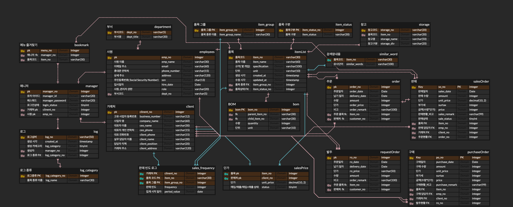

# 📉 실무자들의 효율적인 전산 사용 및 업무를 돕는 ERP 프로그램
## ⭐팀명: 일등할 공대, 다들 환호해조(18기 1조)⭐

## ✨팀원✨
<table style="width:100%;">
  <thead>
    <tr align="center">
      <th>팀장</th>
      <th>팀원</th>
      <th>팀원</th>
      <th>팀원</th>
    </tr>
  </thead>
  <tbody>
    <tr align="center">
      <td>
        
      </td>
      <td>
        
      </td>
      <td>
        
      </td>
      <td>
        
      </td>
    </tr>
    <tr align="center">
      <td>육세윤</td>
      <td>이인화</td>
      <td>서현원</td>
      <td>최정필</td>
    </tr>

  </tbody>
</table>

## 📚 목차
1. [📂 프로젝트 소개](#intro)
   1) [🎯 프로젝트 주제](#topic)
   2) [📱 프로젝트 배경](#background)
    
2. [📝 요구사항 명세서](#requirements)
   
4. [🔗 ERD](#erd-link)
   
6. [📄 테이블 명세서](#table_specifications)
   
8. [👨‍💻 프로젝트 후기](#retrospective)

 

## 1. 프로젝트 소개
###  1) 프로젝트 주제
- 유통업 영업 사원의 효율적인 판매 관리 시스템
###  2) 프로젝트 배경
-  유통업 영업 사원들은 팩스, 이메일, 각기 다른 엑셀 파일 등 비정형적인 주문을 수작업으로 처리하는 데 많은 시간을 낭비하고 있습니다. 이러한 반복적인 데이터 입력 작업은 업무 비효율과 잦은 휴먼 에러를 유발하며 실시간 데이터 통합을 어렵게 만듭니다.
   이 문제를 해결하고자 주문 채널을 통합하고 판매 관리 프로세스를 자동화하는 ERP 시스템을 개발했습니다. 본 시스템을 통해 영업 사원들은 서류 작업에서 벗어나 핵심 영업 활동에 집중할 수 있습니다.

 

## 2. 요구사항 명세서

요구사항 명세서 링크

https://docs.google.com/spreadsheets/d/1k7wxdafWGjq7NR42We7jSud8SaC5Y8va/edit?gid=980491185

- ### 시스템
####   1. 회원관리
1) 사용자 등록
2) 가입 승인 및 권한 설정
3) 가입 결과 알림
4) 기본 로그인 기능
5) 접근권한 제어
6) 로그인 상태 유지/만료

#### 2. 품목관리
1) 품목 등록
2) 품목 사용 중지
3) 품목 삭제
4) ⭐품목 검색⭐
  : 품목명/코드/유사단어 검색
5) 품목 수정
6) 품목 상세보기

#### ⭐3. 납품 이력 관리⭐
1) 구매전표 입력
2) 품목 및 수량 입력
3) 구매전표 저장 및 수정
4) 구매전표 조회 및 검색
5) 구매전표 상태 관리
6) 판매 주문서 입력
7) 품목 및 수량 입력
8) 판매 주문서 저장 및 수정
9) 판매 주문서 조회 및 검색
10) 판매 주문서 상태 관리

#### ⭐4. 입력 추천 관리⭐
1) 거래처 추천 입력
2) 영어사원 품목 추천
3) 추천 품목 편집
4) 수동 입력 병행

#### ⭐5. 통계 및 조회 시스템⭐
1) 구매관리
2) 재고관리
3) 출하 및 판매관리
4) 관리지원

#### ✨7. 메뉴 즐겨찾기 설정✨
1) 즐겨찾기 등록
2) 즐겨찾기 조회
3) 즐겨찾기 삭제
4) 즐겨찾기 순서 변경

 

## 3. ERD

 ERD 이미지 

 

## 4. 테이블 명세서

 테이블 명세서 보기 

 

## 5. 프로젝트 후기
| 이름 | 후기                 |
|:---:|:-------------------|
| 육세윤 | (여기에 후기를 작성해 주세요.) |
| 이인화 |  지금까지 한 팀플 중에서, 최고었습니다. 우리 팀원들 최고에요!          |
| 서현원 |                    |
| 최정필 |                    |
